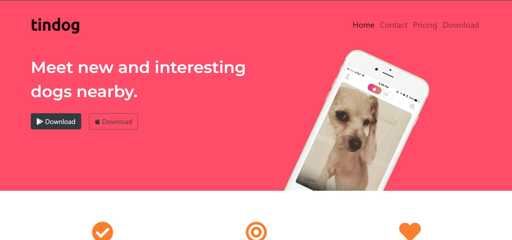
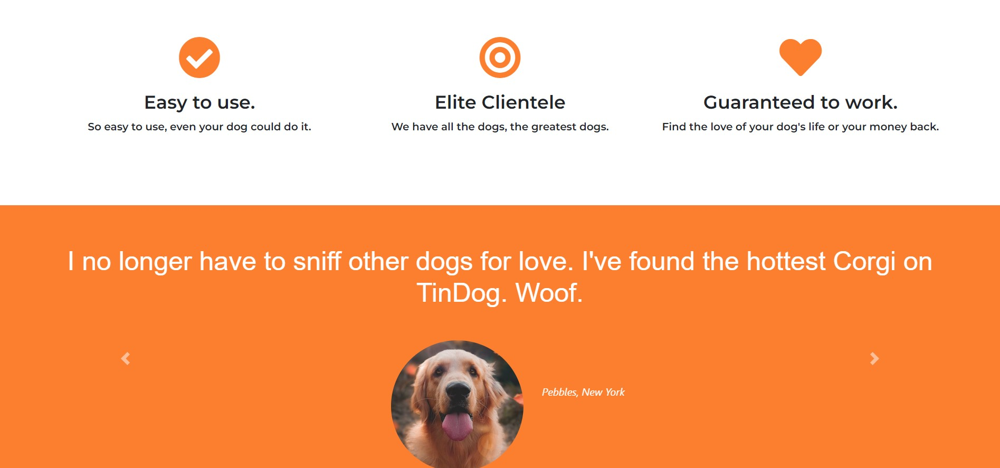
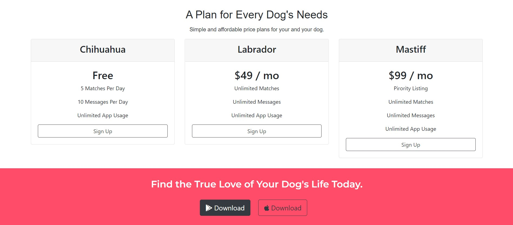

# TinDog

<h4>A basic webpage created using HTML and CSS. Came across various CSS concepts like Z-index and learnt to use bootstrap</h4>

<p align="center">
  <a href="#key-features">Key Features</a> •
  <a href="#download">Download</a> •
  <a href="#screenshots">Screenshots</a> •
</p>

## Key Features

- **A simple website built using HTML and CSS along with Bootstrap. The website is responsive to all device screen sizes.**

## Download

Execute the following commands on the Command Line.

```bash
# Clone this repository
$ git clone https://github.com/ShauryaMagar/tinDog/

# Go into the repository
$ cd tinDog

# Open index.html
```

## Screenshots

<br>

<br>

<br>

<br>
> GitHub &nbsp;&middot;&nbsp; [@ShauryaMagar](https://github.com/ShauryaMagar)
